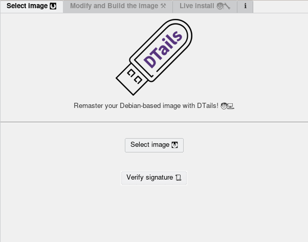
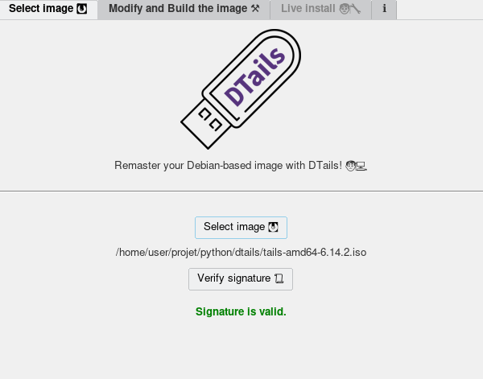
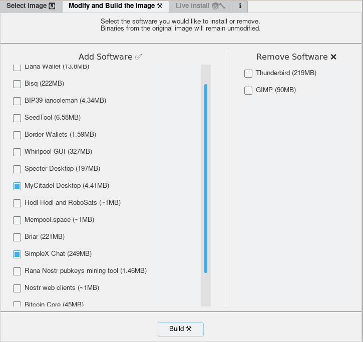

<p align="center">
    
</p>
<h1 align="center">DTails</h1>

<p align="center">
  <a href="https://opensource.org/license/gpl-3-0/" title="License: GPLv3">
    
  <a href="https://twitter.com/BangalaXMR" title="Twitter">
  
  </a>
</p>


# ℹ️ About

DTails is a tool that helps to add software in Debian based live images like Tails. DTails is not a distribution.

# ℹ️ State of the fork
- Better GUI
- Gnupg verification of the image
- Software list versioning updated
- Better debugging

## 📦 Packages requirements

```bash
sudo apt satisfy genisoimage parted squashfs-tools syslinux-utils build-essential python3-tk python3-pil.imagetk python3-pyudev python3-gnupg -y
```

## 🛠 Getting started
Clone the repository with:

```bash
git clone https://github.com/BangalaXMR/dtails
```

Once you have clone the repository and you get inside the directory. Run this to start the GUI:


```bash
sudo ./dtails.py
```

#### Why sudo?
Sudo is needed to mount the <b>.iso / .img</b> into a directory, as well to use other software. Without it, we can't use those GNU/Linux tools.

### 1. 💿 Select the Tails image


### 1.1 Verify GnuPG signature


### 2. 📥 / 📤 Add or remove packages
 1. Click on the checkboxes to add (Left) or remove (Right) the software you like.
 2. Click on "Build" once you are ready to build your image.



You can keep track in that is happening in your terminal.


### 3. 💽 .iso vs .img
**❌ Persistence:** If you choose **.iso** image you will build an **DTail.iso** image in the same DTails directory.

**✅ Persistence:** In case you choose **.img**, you will be redirected to the 3º tab where you can choose the flash drive to install your modified OS into it.


Connect your flash drive and choose the right one. (Double check it once you select it!)


---
## 📦 List of software

To install  | To remove |
:----- | :----: |
Sparrow Wallet    | Thunderbird |
Liana Wallet   | GIMP  |
Bisq
BIP39 iancoleman
SeedTool
Border Wallets
Whirlpool GUI [🌐](https://github.com/DesobedienteTecnologico/dtails/pull/15)
Specter Desktop
MyCitadel Desktop
Bitcoin Core
Hodl Hodl and RoboSats
Mempool.space
Briar
SimpleX Chat
Rana Nostr Pubkeys mining tool
Nostr web clients (Snort & Iris)
Feather Wallet
Cake Wallet

*🌐 Chroot connects to internet to download packages

---

## **Video Spanish & English**

<a href="https://www.youtube.com/watch?v=QABz-GOeQ68"></a>

